# Maze Runner

## About

- This is a maze game where a player starts from a given start location in the maze and eventually 
  tries to reach the destination location.
- The player collects treasure on his way to the destination.
- While travelling through the dungeon, the player may be encountered by deadly monsters 
  called Otyugh who kill anyone who enters their cave.
- The player can slay these monsters using arrows. The player has 3 arrows at start and can find 
  more while travelling the dungeon.
- To win the game, the player must slay these monsters and reach the end location.


## Features

Following are the feature provided by the game -

1. Generates an intriguing dungeon which the player can move around, finally to reach the 
   destination. 
2. Allows the player to collect treasure along the way.
3. There are deadly monsters in the dungeon who kill anyone who enter their cave.
4. Player can slay these monsters using arrow that he carries and collects while travelling 
   through the dungeon model.
5. The locations near monster will give out a strong pungent smell which would signify a monster 
   nearby.
6. Each cell in the dungeon model can have multiple entry/exit and the player can pick anyone.
7. The game ends when the player reaches the destination location after killing monsters as 
   required.
8. The game also provides AUDIO_PLAYBACK for several actions.

## Running the jar file

The jar can be run in 2 modes - 
1. GUI mode
```
   java -jar 'absolute path to jar file/*.jar'
```
Example: java -jar PATH/Project3Dungeon.jar

2. Running in Text based mode -
```
    java -jar 'absolute path to jar file/*.jar' wrapping noRows noColumns interconnectivity 
    percentageOfCaveContainingTreasue noOfMonster

   When running the program, you need to specify following in the given order-
   wrapping -> {1 - Non-wrapping / 2 - wrapping} -> Determines if the dungeonmodel is wrapped
   noRows -> {4 <= n <= 2147483648} - > Determines the number of rows
   noColumns -> {4 <= n <= 2147483648} - > Determines the number of columns
   interconnectivity -> {0 <= n <= 2147483648} -> Determines interconnectivity
   percentageOfCaveContainingTreasue -> {0 <= n <= 100} -> Percentage of caves containing treasure.
   noOfMonster -> {1 <= n <= noOfCaves} -> Numeric value representing the number of monster present in the dungeonmodel.
```
Example: java -jar PATH/Project3Dungeon.jar 1 4 6 0 30 3


## Using the program

### GUI based mode:
1. Start the program by executing the jar.
2. This will launch the game and appropriate instructions to play will be displayed on the screen.
3. Press ARROW_KEY for moving through the dungeon.
4. Press p followed by a treasure or weapon shortcut to pick it. The shortcut will be displayed 
   in the game on the right panel.
5. Press s followed by number(distance) followed by ARROW KEY(direction) to shoot.

 ### Text based mode: 
1. Start using the program by entering the above-mentioned parameters above.
2. The program, at each step will output the user where he is currently, and the directions he 
   can travel from current location. The program will then prompt the user to select an action 
   which can be 
   1. Move -> To move to a new location
   The acceptable domain here includes -
      {n,s,e,w} which stand for {North, South, East, West} respectively.
   2. Pickup -> A treasure or an arrow
   3. Shoot -> Shoot an arrow in the specified direction, at the given distance
4. Enter one of the location from the possible location that the player can move from his current 
   location, after which the player will be moved to the new location.
5. At each step the player can choose to pick up the treasure and weapon and also shoot arrow.
6. Once the player reaches the end location and kills the monster in the destination cave, he 
   will be greeted by the game completion message.

## Description of GUI based sample run
1. Shows the game screen-
   1. The game instructions are displayed on the right
      bar.
   2. The player details are displayed below instruction.
   3. The details of player's current location is also displayed.
2. The locations which are not yet explored will not be visible.
3. The player smells a strong smell, indicating a monster nearby.
4. The image shows the state at the start of the game. The player will have no treasure and 3
   crooked arrows.

5. The following images show before/after picking treasure and weapon. We can see the treasure 
   was visible in the first image and get disappeared in the second. Consequently, the treasure 
   and arrow collected by player increases. 
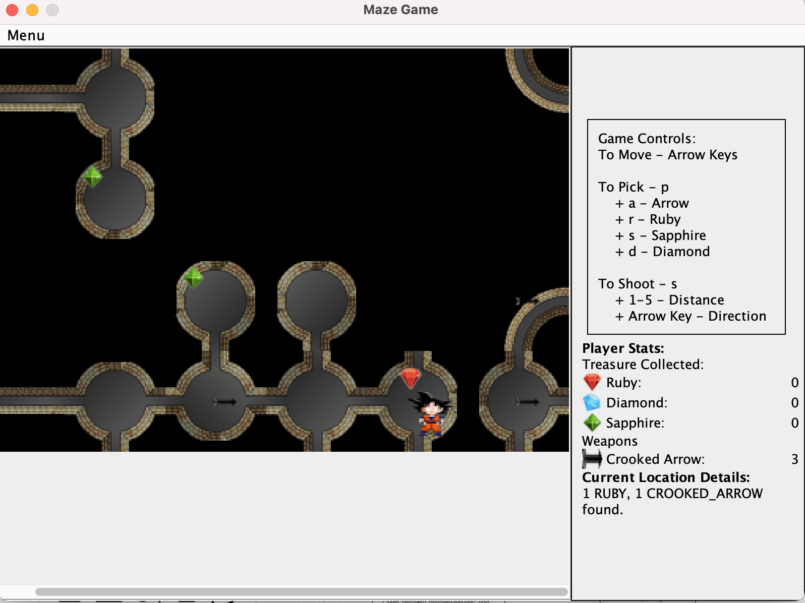
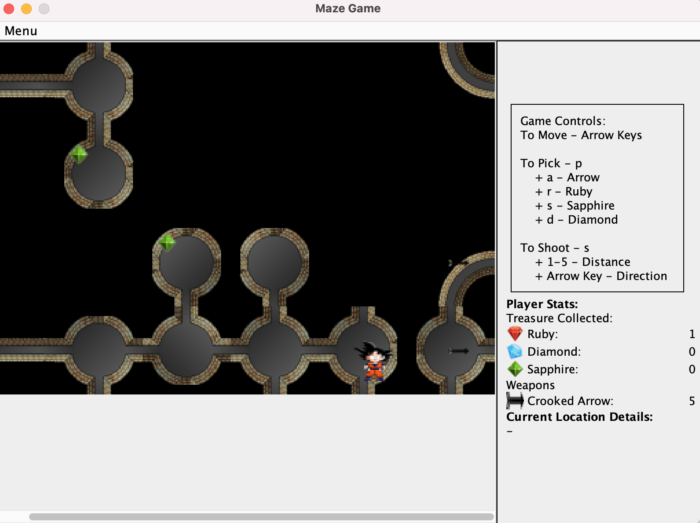

7. A message appears when you kill a monster. An audio playback also be triggered for this action.
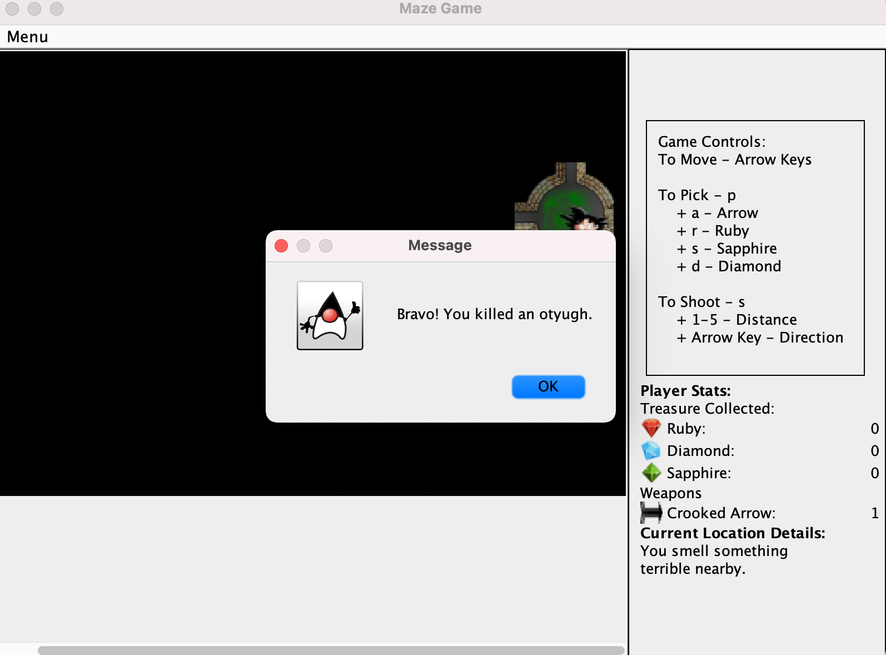

8. The paths keep on getting visible as the player explores the dungeon.
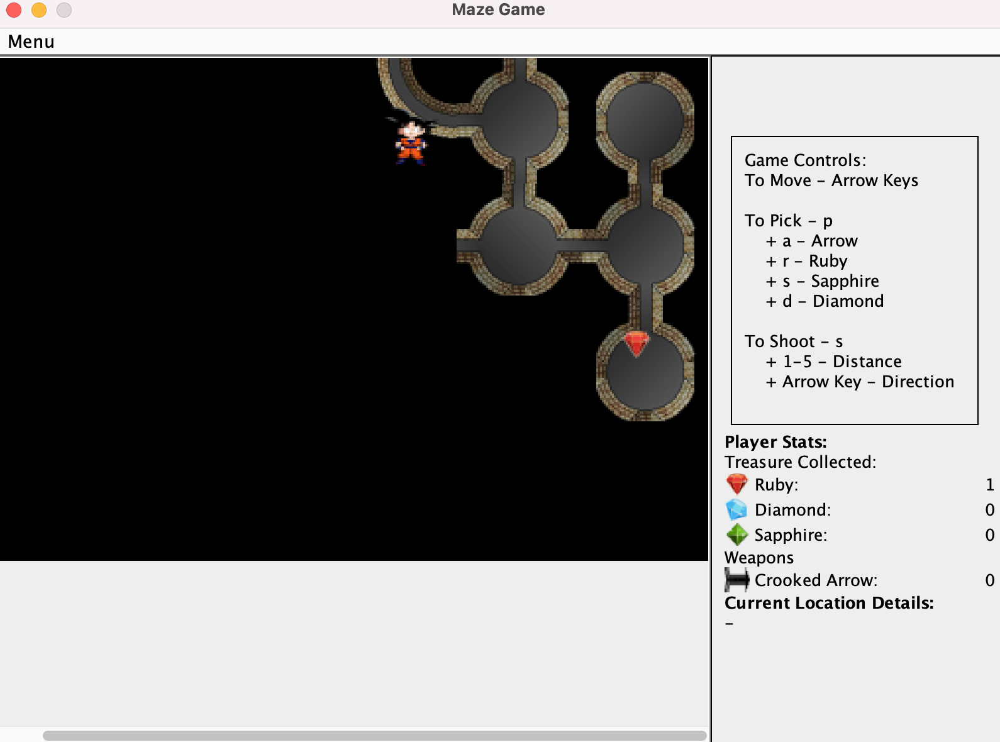
9. The following images shows a half injured otyugh. This only happens when the player enters a 
   cave with an injured otyugh and safely escapes. 
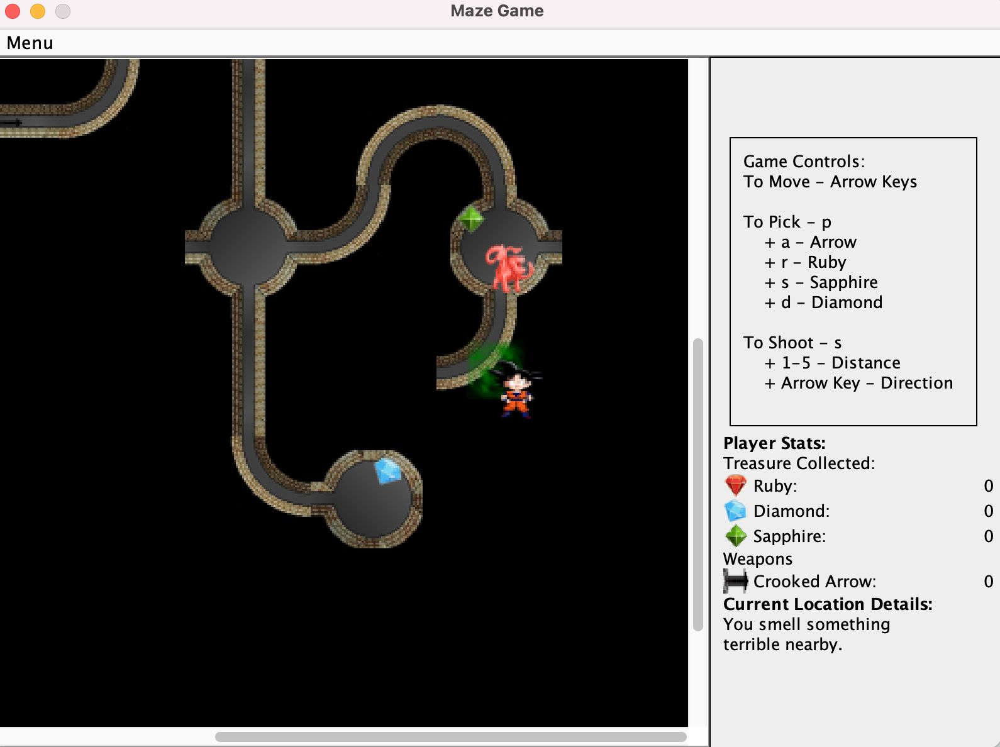
10. Shows when a player getting killed. An audio playback also be triggered for this action.
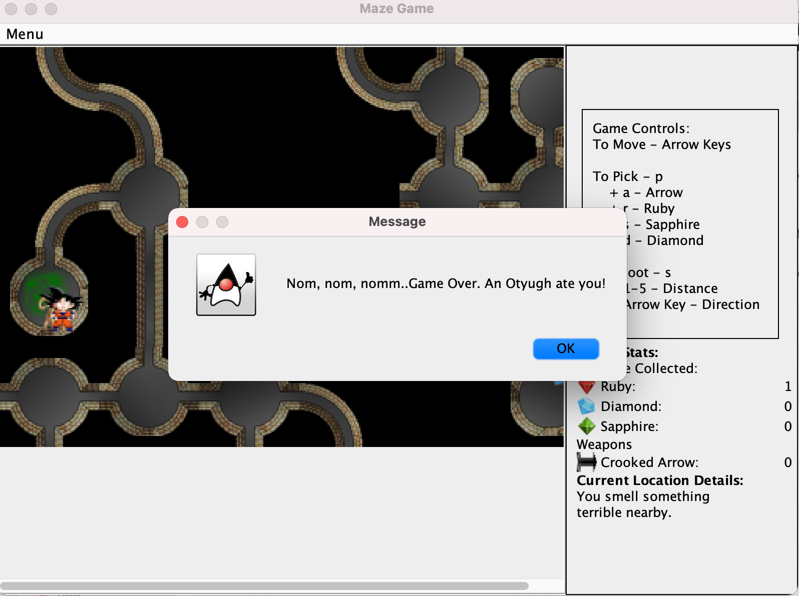
11. Player can select following options
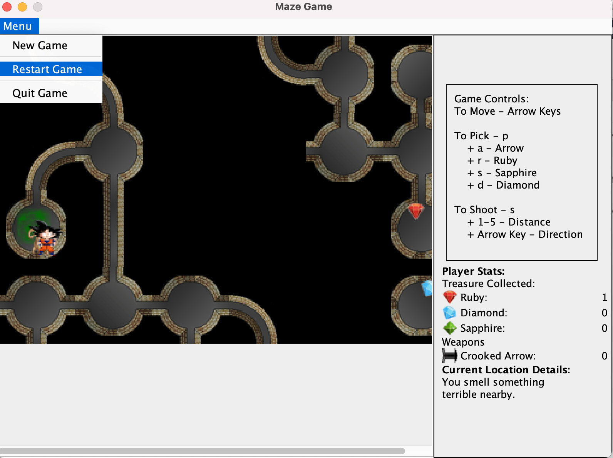
12. Player can select restart game on the same dungeon
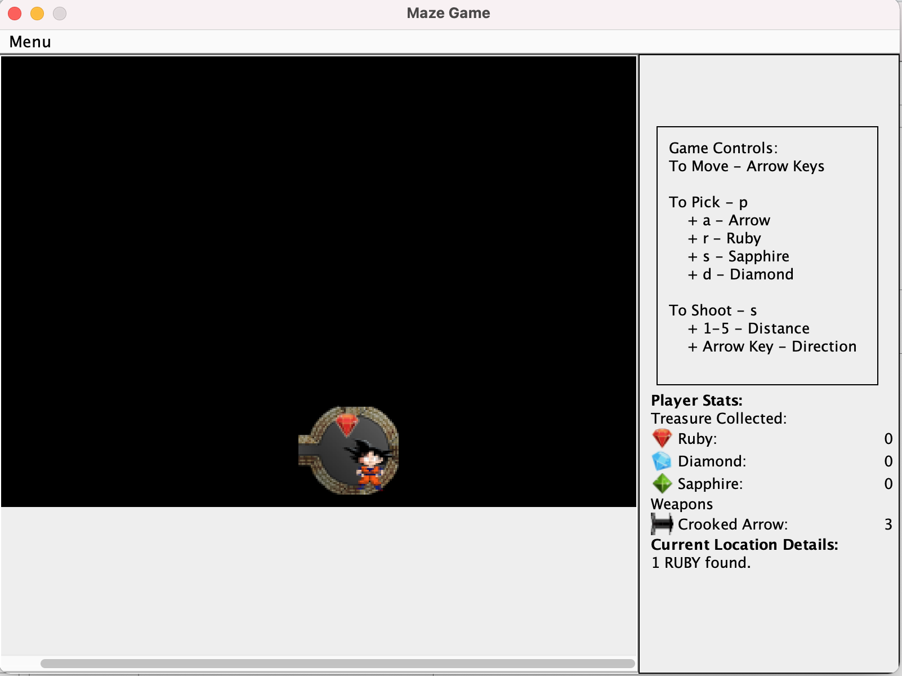
13. When user selects a new Game
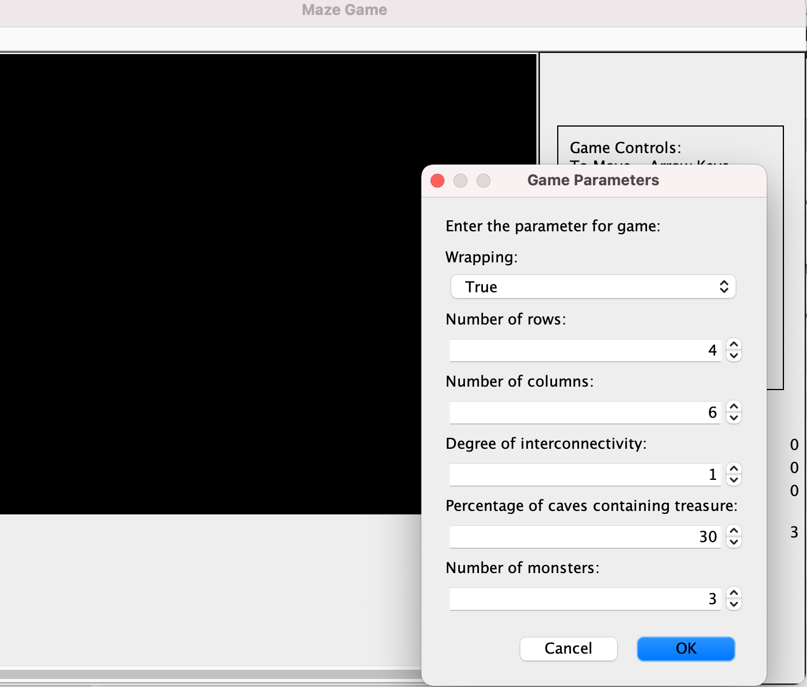
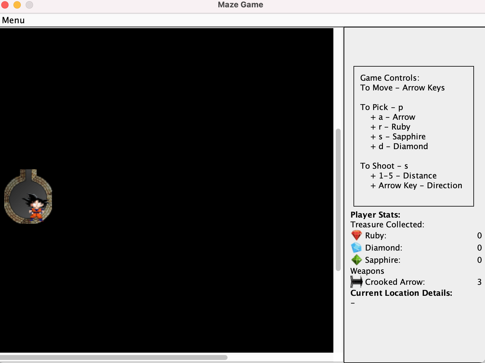
14. User winning a game. An audio playback also be triggered for this action.
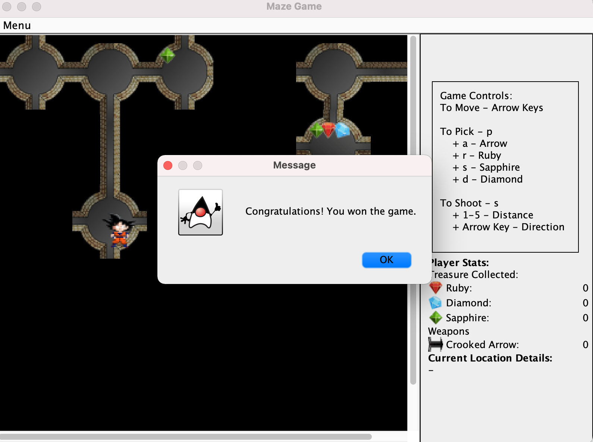


## Description of text based sample run
_samplerun1_

Parameters to run : /Project3Dungeon DriverProject4 1 4 6 0 30 3
1. This sample run uses a deterministic dungeon and shows a player getting eaten by an Otyugh.
2. First the player move EAST and smells a MILD stench.
3. He then fires all the available arrows.
4. He still finds a stench.
5. He tries to fire more arrow but gets message than no more arrows exist.
6. He check the player description and confirms this.
7. He move to the east and gets eaten by an Otyugh.

_samplerun2_

Parameters to run : /Project3Dungeon DriverProject4 1 4 6 0 30 3
1. This sample run uses a deterministic dungeon and shows a player killing monster and winning 
   the game.
2. The player find treasure and arrow in a cave.
3. He picks both of them.
4. He tries to pick more treasure and arrow more that what exist, but gets corresponding 
   validation message.
5. He then moves and ends up in a location with a MILD stench.
6. He fires 2 arrows and kills an Otyugh.
7. He moves ahead and ends up in a location with MILD stench.
8. He moves ahead and ends up in a location with STRONG smell.
9. He fires 2 arrows and kills another monster.
10. He moves ahead, reached the end cave and WINS the game.

_samplerun3_

Parameters to run : /Project3Dungeon DriverProject4 1 4 6 0 30 3
1. This sample run uses a random dungeon and shows a player killing monster and winning
   the game.
2. The player moves in the dungeon.
3. He finds a ruby and picks it.
4. Moving ahead he ends up in a cave with a MILD stench.
5. He fires arrows and kills the monster.
6. He moves ahead and ends up in the end cave, and wins the game.

_samplerun4_

Parameters to run : /Project3Dungeon DriverProject4 1 4 6 0 30 3

1. This sample run uses a random dungeon and shows a player getting eaten by an Otyugh.
2. The player moves to a location and notices a MILD stench.
3. He moves to another location and receives a STRONG pungent smell.
4. He further tries to move and enters a CAVE containing an Otyugh. The otyugh kills the player, 
   and he loses the game.

## Design Changes
1. Divided the UI panel into more modular parts-
   1. A panel to display Instructions.
   2. A penal to display current score and game state.
   3. A panel containing the maze.
2. Used command pattern for Pick, Move and Shoot function, thus allowing greater flexibility.
3. Read the game instructions from a text file, so one can update it with ease.

## Assumptions
1. When the interconnectivity is specified more than the maximum possible connections the 
   dungeon will be a fully open dungeon.
2. When the value for number of monsters in dungeon is entered more than the number of caves, 
   each cave will have a monster(except the start) and the remaining additional monster count 
   will be neglected. 
3. No weapons will be added at the destination cave as there is
   no point collecting a weapon after reaching the destination.
4. The player must compulsorily kill the Otyugh at the end cave to win

## Limitations

1. The game may sometimes lag due to the use to legacy tools.

## Citations
1. Package&nbsp;javax.swing. javax.swing (Java Platform SE 7 ). (2020, June 24). Retrieved December 1, 2021, from https://docs.oracle.com/javase/7/docs/api/javax/swing/package-summary.html.
2. How to use gridbaglayout. How to Use GridBagLayout (The Java™ Tutorials &gt; Creating a GUI 
   With Swing &gt; Laying Out Components Within a Container). (n.d.). Retrieved December 3, 2021, from https://docs.oracle.com/javase/tutorial/uiswing/layout/gridbag.html.
3. Swing tutorial. (n.d.). Retrieved December 1, 2021, from https://www.tutorialspoint.com/swing/index.htm.
4. Download Free Video Game Sound effects. Mixkit. (n.d.). Retrieved December 10, 2021, from 
   https://mixkit.co/free-sound-effects/video-game/. 